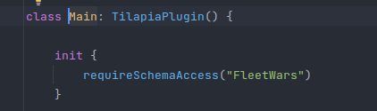

# The Horizontally Scalable & High Performance Mini-Games Design

**Author**: fan87

## I. Introduction
I've seen a lot of Minecraft "networks" that use some proxy software to connect multiple Minecraft
servers together, and run one game on each individual Minecraft server. The pro is that it's
really easy to setup, and it's really easy to understand, and you can
use plugins on the market for minigames and lobbies, while the cons being non-horizontal scalable,
and difficult to deploy changes with Rolling Update technique, which means players must be
disconnected from a server, or a period of time that people can't join in order to do a server update.
It's good for small Minecraft networks, or a private server, but not for large-scaled Minecraft
network.

We, as Tilapia team, are designing our code to be scalable from the beginning, and we've
designed and came up (not invented as some large networks could also be using some similar
mechanics) with a centralized & containerized solution. In short, we have a centralized
server that manages all the games, with respect of Rolling Updates, and scalability, with
easy to use Kotlin Games API.

## II. Communication with Centralized Server 
Usually you don't need to take care about this part, but it's better to understand how our network
works behind the scene, so you can have the ability to debug our code-base.

The central server is a HTTP server, while every Minecraft server that needs to connect
to it needs to be connecting to a websocket server. The API key is also required in the header.

Once a client has established the communication to the central server, it needs to provide
the list of Database it needs to access (For security).

> Main.kt of Fleetwars plugin

The protocol will rarely be updated, but for latest protocol
specification, please check out the code of module 
`tilapia-communication`

# WIP

(c) TilapiaMC  All rights reserves

