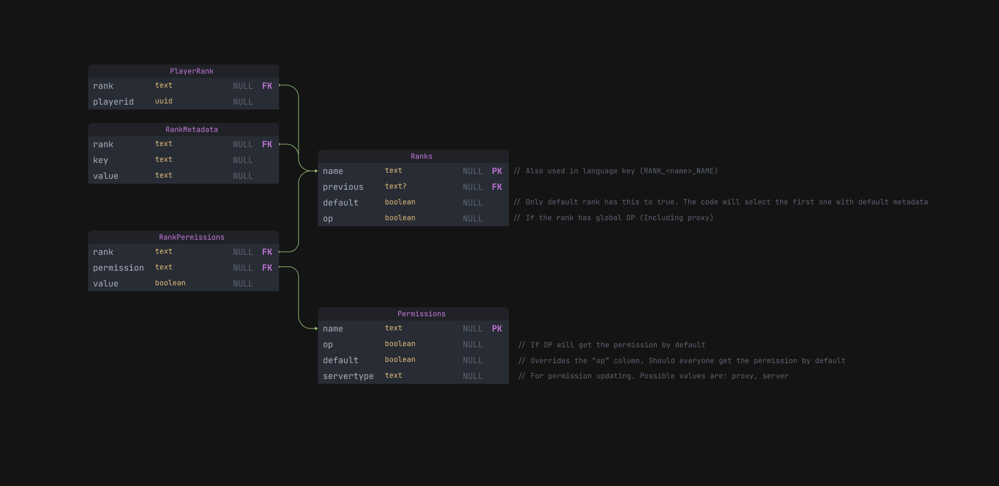

# Tilapia Infrastructure

This documentation outlines the infrastructure and the current implementation of our main systems and modules.

## Introduction

### Terms we use in this documentation

- Module. Module refers to something that could be plugged into our current system without doing integration and modification of our current code base. It will usually be presented as a Bukkit plugin or directly into `tilapia-api` sub-project. There may be some modules that are integrated into some of the game extensions (e.g. Party module, that is integrated directly into the team game extension)

- System. System refers to something directly implemented in the core (`tilapia-core` or defined and implemented in `tilapia-api`). Adding a new system may require modification to the current codebase, for example, the rank system. Rank system requires 
- Units. When you are reading this, all the units are probably finished and you won't have to code more units, they refers to a direct deployment on our server, for example, our game central unit, or MySQL database unit.

### General Rules

There are a several general rules that gets applied to most of our modules and systems.

1. [Systems & Modules] Scalability - they are scalable and will not fail while handling large amount of users
2. [Modules] Pluggable - Modules should be implemented with as minimal changes to the code base as possible.
3. [Systems & Modules] Security - they must be secure, with expectation of other systems or modules being compromised by attackers.
4. [Units] Zero (Or Minimal) Downtime - They must have as little downtime as possible, and have the support of rolling update if possible.

## Network Maintenance

Every week, the server has to be restarted, including our game-central, every proxy, server, and we will update our database as it may include some security updates. It will be announced 6 hours before the maintenance starts. Non-critical updates to our game-central can also be deployed when the maintenance.

Maintenance mode can be started by admin if a critical change has to be deployed as fast as possible. If a emergency update is pending, a graceful shutdown is not required, and should not be used in this situation.

The maintenance will remain for an hour, and gracefully shutdown all the servers, proxies, and our game-central, with 30 minutes time out.

In the maintenance mode, our Maintenance Unit will take place of our main proxy, and handle MOTD & Join messages. It has direct permanent access to our main database with login information stored in the kubernetes secret storage. It does not implement a rank system, but instead directly checks if the player's UUID is whitelisted in the database. If so, the maintenance unit will forward the player to our main proxy unit (that has been closed to private).

During the last 30 minutes of maintenance (After graceful shutdown has timed out), the following things have to be done in order:

1. Check all the servers has been shutdown, no players are online
2. Shutdown Public API and related services (TODO, we may have a discord bot in the future)
3. Shutdown proxies
4. Shutdown main proxy unit
5. Hide main proxy unit
6. Expose the maintenance unit
7. Hide public api unit
8. Shutdown game-central
9. Shutdown database
10. Check database version, apply update
11. Check game-central production version, apply update
12. Check public api production version, apply update
13. Start database, verify the version
14. Start game-central, verify the version
15. Start proxies
16. Start public api unit, with private access
17. Start main proxy unit, with private access
18. Testing new features and normal gameplay through maintenance unit
19. Run public api request based unit test. If failed, restart the entire process and extend the maintenance mode period (REQUIRED). (Should NOT happen)
20. Run game-central request based unit test. If failed, restart the entire process and extend the maintenance mode period (REQUIRED). (Should NOT happen)
21. Last check the health of the network
22. Hide the maintenance unit
23. Expose main proxy unit
24. Expose public api unit
25. Check the health of the network

## Master Control

### Kubernetes Unit

Our kubernetes unit manages all the containers, deployments, and service load-balancing. As for now, we are using bare-metal kubernetes cluster, hosted and managed ourselves.

It provides several security features, including sandbox all of our servers, and separate them using container - so if one of them is being attacked, it will less likely to affect other nodes or services - even with root access on those containers. 

### Database Unit

We are currently using MariaDB for our database, and it may be changed to MongoDB & Redis (Which is what Hypixel Network is using according to their Dev Blogs). The Database unit is also hosted in our kubernetes unit. The database will remain zero down-time if possible (Unless their are critical changes that has to be deployed, such as security features)

### Maintenance Unit (TODO)

Our maintenance unit will handle server queries (MOTD/Joins). Itself is a proxy server that forwards administrators to our live-testing proxy. For more information, please checkout our [Maintenance](#Network-Maintenance) section.

### Main Proxy Unit (TODO)

Load balance between proxies

### Public API Unit (TODO)

Provides a public API to players, similar to [Hypixel's Public API](https://api.hypixel.net)

### Game Central Unit

The game central is in the project `tilapia-game-central`. The game central unit manages all the running games, servers, proxies, and manages database login. It's designed to be updated as less times as possible to keep low down-time, as it's not being load-balanced, and rolling updates don't apply to this unit.

If a critical change needs to be deployed in the game central unit, the entire server has to go down, as it manages all the proxies and servers, and they won't work without the game central unit.

## Rank System Infrastructure

The implementation of our current rank system:

1. `RanksManager` manages all the ranks
2. Ranks are stored in Database, accessed directly from Database for every match and the proxy
3. `RanksManager` has an implementation of `updateRanks` that fetches all the ranks from the MySQL Database
4. `RanksManager` has an implementation of `changeRank` that changes the rank of a player
5. Rank of a player is directly stored as clear text (For example, `DEVELOPER`) in the database

Database Diagram:

